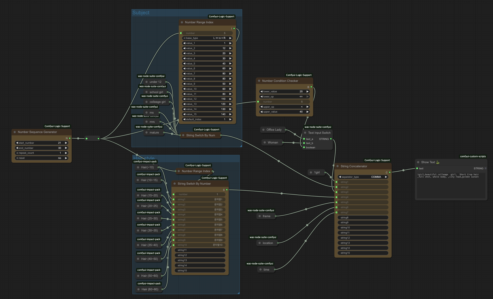

# ComfyUI Logic Support

A collection of logic and utility nodes for ComfyUI to enhance workflow capabilities.

[한국어 README](README_ko.md)

## Overview

ComfyUI Logic Support is a custom node extension that provides various logic and utility nodes to enhance your ComfyUI workflows. These nodes enable more complex conditional logic, string manipulation, and numerical operations.



## Installation

1. Clone this repository into your ComfyUI custom_nodes directory:
   ```bash
   cd /path/to/ComfyUI/custom_nodes
   git clone https://github.com/yourusername/Comfyui-Logic-Support.git
   ```

2. Restart ComfyUI or refresh the page if it's already running.

## Nodes

### NumberRangeIndex

Determines which range a number belongs to and returns the corresponding index.

- **Inputs**:
  - `number`: The input number to check
  - `base_type`: Range calculation method ("L <= n < R" or "L < n <= R")
  - `value_1` to `value_15`: Boundary values for ranges
  - `default_index`: Starting index for results (default: 0)

- **Outputs**:
  - `INDEX`: The index of the range the number belongs to

### BooleanIndexAdder

Adds the index of the first true value among 15 boolean inputs to a base number.

- **Inputs**:
  - `base_number`: The number to add the index to
  - `bool1` to `bool15`: Boolean inputs
  
- **Outputs**:
  - `NUMBER`: The result of adding the index to the base number

### NumberConditionChecker

Checks if a number is within specified bounds and returns a boolean result.

- **Inputs**:
  - `lower_value`: Lower bound value
  - `lower_op`: Lower bound operator ("NONE", "<", "<=")
  - `number`: The number to check
  - `upper_op`: Upper bound operator ("NONE", "<", "<=")
  - `upper_value`: Upper bound value
  
- **Outputs**:
  - `BOOLEAN`: True if the number satisfies all conditions, otherwise False

### StringConcatenator

Concatenates up to 15 input strings into a single output string with a specified separator.

- **Inputs**:
  - `separator_type`: Type of separator ("EMPTY", "COMMA", "SPACE", "PIPE")
  - `string1` to `string15`: Strings to concatenate
  
- **Outputs**:
  - `STRING`: The concatenated string

### StringSwitchByNumber

Outputs a string based on a numeric index input, supporting up to 15 strings.

- **Inputs**:
  - `number`: Index of the string to output (1-based)
  - `string1` to `string15`: Available strings
  
- **Outputs**:
  - `STRING`: The selected string

## Examples

### Using NumberRangeIndex for Conditional Processing

```
[Number Input: 15] → [NumberRangeIndex] → [Index determines further processing]
```

### Creating Dynamic Text with StringConcatenator

```
[Text Input 1: "Hello"] → [StringConcatenator: SPACE] → [Output: "Hello World"]
[Text Input 2: "World"] ↗
```

### Conditional Logic with BooleanIndexAdder

```
[Base Number: 10] → [BooleanIndexAdder] → [Output: 12]
[Boolean Input 1: False] ↗
[Boolean Input 2: True] ↗
```

## License

MIT License

## Contributing

Contributions are welcome! Please feel free to submit a Pull Request.

## Example Workflow

The repository includes an example workflow (`logic_support_example.json`) that demonstrates how to use the logic nodes to create dynamic text prompts based on numeric inputs like age. This workflow uses:

- `NumberRangeIndex` to determine age ranges
- `StringSwitchByNumber` to select appropriate text based on the age range
- `StringConcatenator` to combine multiple text elements into a final prompt

You can load this example in ComfyUI by using the "Load" button and selecting the `logic_support_example.json` file.
